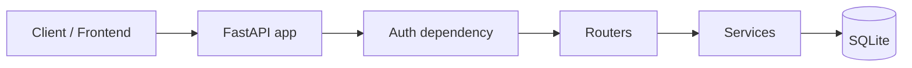

# Football Analytics API with Favourite Player Lists – Project Plan

## 1. Goals and alignment

- **Project**: Backend REST API + simple frontend for football analytics; users manage **favourite player lists** (main CRUD feature). Dataset resources (players, teams, performances, transfers, market value) are **read-only**.
- **Coursework**: Meets COMP3011 minimum (one full CRUD model, 4+ endpoints, JSON, status codes, demonstrable) and targets high bands via clean architecture, documentation, testing, and deployment.
- **Code quality**: Senior-level – type hints, separation of concerns, dependency injection, env config, consistent error responses, maintainable structure, no monolithic files.

## 2. Technology stack


| Layer      | Choice                  | Rationale                                                       |
| ---------- | ----------------------- | --------------------------------------------------------------- |
| Backend    | Python, FastAPI         | Async support, auto OpenAPI, Pydantic validation, clear routing |
| ORM        | SQLAlchemy              | ERD mapping, migrations, dependency-injected sessions           |
| Validation | Pydantic                | Request/response schemas, clear error messages                  |
| Database   | SQLite (dev)            | Single file, no server; suitable for coursework deployment      |
| Testing    | pytest + httpx          | API and status-code testing, TestClient                         |
| Frontend   | HTML + CSS + JavaScript | No framework; fetch API, simple UI, clear layout                |


## 3. Dataset strategy and ERD mapping

**Source**: CSVs under `web/archive/`. Filter **before** import to top five European leagues only.

**Top 5 leagues (filter by `competition_id` to avoid ambiguity e.g. Austrian "Bundesliga")**:


| League               | competition_id | competition_name in data |
| -------------------- | -------------- | ------------------------ |
| Premier League       | GB1            | Premier League           |
| La Liga              | ES1            | LaLiga                   |
| Serie A              | IT1            | Serie A                  |
| Bundesliga (Germany) | L1             | Bundesliga               |
| Ligue 1              | FR1            | Ligue 1                  |


**TOP_5_COMPETITION_IDS** = `['GB1', 'ES1', 'IT1', 'L1', 'FR1']` – use this for all filtering (not competition_name, to avoid LaLiga vs "La Liga" and Austrian Bundesliga).

**Dataset tables** (imported, read-only from API): `players`, `teams`, `player_performances`, `transfer_history`, `player_market_value`. **Application tables** (created by project, writable): **FavouriteList** (the main full CRUD resource), **FavouriteListPlayer** (supports many-to-many membership: add player, remove player, view list players – not a separate full CRUD resource).

**CRUD wording (for report/plan)**: The main database-backed CRUD resource is **FavouriteList**. **FavouriteListPlayer** supports many-to-many membership between favourite lists and players (add/remove/view only).

### 3.1 CSV → ERD mapping and import strategy

**Source of truth for league context**: `team_details.csv` and `team_competitions_seasons.csv` both have `competition_id` and `competition_name`. Use `competition_id in TOP_5_COMPETITION_IDS` to identify teams and performances in the top 5 leagues.

**CSV → DB mapping**:


| CSV file                                                    | ERD / DB table                               | Key columns                                                                                                                | Notes                                                                                                                                                                                           |
| ----------------------------------------------------------- | -------------------------------------------- | -------------------------------------------------------------------------------------------------------------------------- | ----------------------------------------------------------------------------------------------------------------------------------------------------------------------------------------------- |
| `player_profiles/player_profiles.csv`                       | players (PLAYER_PROFILES)                    | player_id (PK), date_of_birth, position, main_position, current_club_id (FK→teams), player_name, height, citizenship, etc. | Source of truth for players. **Age**: derived from date_of_birth. No minutes_played or market_value here.                                                                                       |
| `team_details/team_details.csv`                             | teams (TEAMS_DETAILS)                        | club_id (PK), club_name, country_name, competition_id, competition_name, season_id                                         | One row per club per season per competition. Filter: keep rows where competition_id in TOP_5. Deduplicate to unique club_id for `teams` table (or keep one row per club_id with latest season). |
| `team_competitions_seasons/team_competitions_seasons.csv`   | teams_competitions_seasons (bridge)          | club_id, season_id, competition_id, competition_name                                                                       | Use to build set of club_ids that ever played in TOP_5 leagues. Filter: competition_id in TOP_5.                                                                                                |
| `player_performances/player_performances.csv`               | player_performances (PLAYER_PERFORMANCES)    | player_id, season_name, competition_id, competition_name, team_id, goals, assists, minutes_played, yellow_cards, etc.      | **minutes_played** lives here (not in player profile). Filter: competition_id in TOP_5. Import raw rows (no pre-aggregation).                                                                   |
| `transfer_history/transfer_history.csv`                     | transfer_history (PLAYER_TRANSFER_HISTORIES) | player_id, from_team_id, to_team_id, transfer_date, value_at_transfer, transfer_fee, season_name                           | Filter: keep transfers where from_team_id or to_team_id in allowed club_ids (teams that appear in top-5 league context).                                                                        |
| `player_market_value/player_market_value.csv`               | player_market_value (PLAYER_MARKET_VALUES)   | player_id, date_unix, value                                                                                                | Historical values. **Latest value**: per player, row with max(date_unix). Filter: keep only for player_ids that we keep.                                                                        |
| `player_latest_market_value/player_latest_market_value.csv` | optional / view                              | player_id, date_unix, value                                                                                                | One row per player = latest value. Can be used instead of aggregating player_market_value for "current market value".                                                                           |


**How players are linked to teams**: `players.current_club_id` → `teams.club_id`. For listing "players in a team" use this. Teams are identified by `club_id` in the CSVs.

**Filter order (so FKs resolve)**:

1. From `team_details` or `team_competitions_seasons`, build **allowed_competition_ids** = TOP_5 and **allowed_club_ids** = set of club_id where competition_id in TOP_5.
2. From `player_performances`, build **allowed_player_ids** = player_id where competition_id in TOP_5 (players who have ever played in top 5 leagues). Optionally also include players whose current_club_id is in allowed_club_ids (from player_profiles).
3. **Teams**: import from team_details where competition_id in TOP_5; deduplicate by club_id so each club appears once (or keep one row per club per season if you need season-level teams).
4. **Players**: import from player_profiles where player_id in allowed_player_ids (or current_club_id in allowed_club_ids).
5. **Player performances**: import only rows where competition_id in TOP_5.
6. **Transfer history**: import only rows where from_team_id and to_team_id are in allowed_club_ids (or where player_id in allowed_player_ids).
7. **Player market value**: import only rows where player_id in allowed_player_ids. For "current market value" in API: use latest row per player (max date_unix) or import from player_latest_market_value filtered by allowed_player_ids.

**Market value**: Stored historically in `player_market_value`; "current" = latest by date. Either compute at query time (subquery max(date) per player) or maintain a derived table/view from `player_latest_market_value` for filtered players. **Performances**: Import raw (one row per player/season/competition/team); no pre-aggregation.

## 4. Architecture and folder structure

**Request flow**: Client → API routes → service layer → database layer.




**Backend structure** (clean, modular):

```
app/
  main.py              # App factory, include routers, CORS
  database.py          # Engine, SessionLocal, get_db dependency
  config.py            # Env (e.g. DATABASE_URL, API_KEY)
  models/              # SQLAlchemy models (Player, Team, FavouriteList, etc.)
  schemas/             # Pydantic request/response schemas
  routers/             # players, teams, favourite_lists
  services/            # Business logic (reusable, no HTTP)
  auth/                # API key validation dependency
frontend/
  index.html           # Entry; nav to Players / Favourite Lists
  styles.css           # Layout and components
  script.js            # Or split: players.js, favourite-lists.js
scripts/
  filter_and_import.py # Filter CSVs by top-5 leagues, load into DB
tests/
  conftest.py          # Fixtures (client, db, test API key)
  test_players.py
  test_teams.py
  test_favourite_lists.py
  test_auth.py
requirements.txt
README.md
.env.example
```

- **Routers**: Thin – parse request, call service, return response. No business logic in routers.
- **Services**: Reusable functions; accept `db` session (injected); return domain objects or raise domain exceptions; used by routers.
- **Dependency injection**: `get_db()` yields a session; services receive it; no global session.

## 5. Database layer

- **Dataset models** (read-only from API perspective): `Player`, `Team`, `PlayerPerformance`, `TransferHistory`, `PlayerMarketValue`. Map from existing CSVs; ensure FK relationships (e.g. player_id, team_id, competition_id) match ERD.
- **Application models**: `FavouriteList`, `FavouriteListPlayer` (unique on `(list_id, player_id)` to avoid duplicates).
- **Sessions**: Use SQLAlchemy session with dependency injection; commit/rollback in one place (e.g. middleware or route try/finally).
- **Migrations**: Alembic (or create_all for minimal setup); document how to run migrations and import in README.

## 6. API design (REST, resource-based URLs)

**Base path**: `/api/v1`. All responses JSON; consistent structure: `data` for payload, `detail`/`message` for errors.

**Players (dataset – read-only)**

- `GET /api/v1/players` – List; query params: `page`, `limit` (default e.g. 20, max 100), `sort_by` = `age` | `market_value` | `minutes_played` | `name` (optional `order` = asc/desc). Response: `{ "data": [...], "page": 1, "total_pages": N, "total_count": N }`.
- `GET /api/v1/players/{player_id}` – Single player; 404 if not found.

**Sorting implementation (explicit, so queries stay clean)**:

- **age**: From `players.date_of_birth`; compute age at query time (e.g. today − date_of_birth). No join.
- **market_value**: Use latest value per player – either from table `player_latest_market_value` (if imported) or subquery on `player_market_value`: per player pick row with max(date). Join or subquery in list endpoint.
- **minutes_played**: Not on `players`; comes from **aggregation** on `player_performances`: `SUM(minutes_played)` per player (over all seasons in DB or over filtered competitions). List endpoint joins (or uses a pre-aggregated view/column if we add one later). Document that this is total minutes across performances.
- **name**: From `players.player_name`; trivial sort.
- For **favourite list players** (`GET /favourite-lists/{id}/players?sort_by=...`): same logic – order the list of players by age, market_value, minutes_played, or name using the same definitions.

**Teams (dataset – read-only)**

- `GET /api/v1/teams` – List (pagination optional).
- `GET /api/v1/teams/{team_id}` – Single team; 404 if not found.

**Player statistics (nested, read-only)**

- `GET /api/v1/players/{id}/performances` – Optional pagination.
- `GET /api/v1/players/{id}/transfers` – Transfer history for player.

**Favourite lists (main CRUD)**

- `POST /api/v1/favourite-lists` – Body: `{ "name": "..." }`. Return 201 + created resource.
- `GET /api/v1/favourite-lists` – List all lists.
- `GET /api/v1/favourite-lists/{id}` – Single list; 404 if not found.
- `PATCH /api/v1/favourite-lists/{id}` – Partial update (e.g. name); 404 if not found.
- `DELETE /api/v1/favourite-lists/{id}` – 204 No Content; 404 if not found.
- `POST /api/v1/favourite-lists/{id}/players` – Body: `{ "player_id": 123 }`. Add player to list; 404 if list or player missing; 409 or 400 if already in list.
- `DELETE /api/v1/favourite-lists/{id}/players/{player_id}` – Remove player from list; 204; 404 if list or link missing.
- `GET /api/v1/favourite-lists/{id}/players` – List players in list; query param `sort_by` = `market_value` | `age` | `minutes_played` | `name`. Return list of player objects (with those fields for sorting).

**Analytics (one standout feature for "football analytics" and 90%+)**  
Add at least one analytics endpoint so the project is clearly "football analytics API", not just "database + favourites". Options (implement at least one):

- `GET /api/v1/analytics/top-scorers` – Query params: `season` (optional), `competition_id` (optional), `limit` (default 10). Aggregate `SUM(goals)` from `player_performances` per player; return top N.
- `GET /api/v1/analytics/top-market-values` – Query param `limit`. Return players ordered by latest market value (from player_market_value max date or player_latest_market_value).
- `GET /api/v1/analytics/most-minutes-played` – Query params: `season` (optional), `limit`. Aggregate `SUM(minutes_played)` from `player_performances` per player; return top N.

Recommendation: implement **top-scorers** (and optionally **top-market-values**) so the API clearly uses football data for analytics.

**Status codes and errors**

- 200 OK, 201 Created (with body), 204 No Content (DELETE).
- 400 Bad Request – validation (Pydantic); body e.g. `{ "detail": [...] }`.
- 401 Unauthorized – missing or invalid `X-API-Key`; consistent JSON body.
- 404 Not Found – resource not found; JSON body.
- 500 – generic message; no internal details.

## 7. Authentication

- **Header**: `X-API-Key: <key>`.
- **Validation**: Dependency (e.g. in `auth/`) that reads header, compares to configured key (env var or DB). If missing or invalid → **401** with JSON body.
- **Scope**: Apply to all `/api/v1/`* routes (or exclude only health/docs if desired). No rate limiting required for this spec but can be added later for "advanced security".

## 8. Backend implementation practices

- **Type hints**: All function parameters and return types; use Pydantic models and optional `TypedDict` where helpful.
- **Schemas**: Separate Pydantic models for request body and response; reuse where possible (e.g. `FavouriteListBase`, `FavouriteListCreate`, `FavouriteListResponse`).
- **Error handling**: Centralised where possible (e.g. exception handlers for 404, 422); services raise domain exceptions or return None; routers map to HTTP status.
- **Response structure**: Paginated lists: `{ "data": [...], "page", "total_pages", "total_count" }`; single resource: `{ "data": { ... } }` or direct object; errors: `{ "detail": ... }` or `{ "message", "code" }`.
- **Environment**: `config.py` reads from env (e.g. `DATABASE_URL`, `API_KEY`); `.env.example` documents required variables; no secrets in code.

## 9. Frontend requirements (minimal scope)

Frontend must stay **minimal** for coursework: no large SPA, no extra features beyond what is below.

- **Players page**: Fetch `GET /api/v1/players` (with pagination and `sort_by`); display list; provide sorting options (age, market_value, minutes_played, name). Use `fetch()` with `X-API-Key` header.
- **Favourite lists page**: Create list (POST), display all lists (GET), open a list and view its players (GET …/players?sort_by=…), add player (POST …/players), remove player (DELETE …/players/{player_id}). Clear layout and simple UI components.
- **Do not**: Add auth UI, dashboards, charts, multiple pages per feature, or framework bloat. Keep it to: display players, create/view/delete favourite lists, add/remove players from a list.
- **Stack**: Vanilla HTML, CSS, JavaScript; no framework. Single `index.html` with navigation or two simple views; shared `styles.css` and `script.js`. Frontend served via FastAPI static or same origin; README documents how to open it and set API base URL.

## 10. Testing (pytest + httpx)

- **CRUD**: Full cycle for favourite lists (create → get → patch → get list players → add player → get again → remove player → delete list). Assert status codes (200, 201, 204, 404) and response shape.
- **Response codes**: 400 on invalid body, 401 when `X-API-Key` missing or wrong, 404 for missing resource.
- **Validation**: Invalid payloads (e.g. empty name, invalid player_id) return 422 or 400 with detail.
- **Authentication**: Tests without key or with wrong key get 401.
- **Sorting and pagination**: GET players with `sort_by` and `page`/`limit`; assert order and pagination fields. GET favourite-lists/{id}/players with `sort_by`; assert correct order.
- **Fixtures**: In-memory SQLite or test DB; seed minimal players/teams; valid API key in headers for authenticated tests. Use `TestClient` or `httpx` against running app.

## 11. Documentation and deployment

- **OpenAPI**: FastAPI exposes `/docs` (Swagger UI) and `/openapi.json`. Add short descriptions and examples for key endpoints; document `X-API-Key` in security scheme.
- **README**: Installation (Python version, `pip install -r requirements.txt`), environment variables (from `.env.example`), database setup (migrations + filter/import script), running the server, running tests, accessing the frontend, and link to API docs (`/docs` and optional exported PDF per coursework).

**Deployment decision (explicit)**  
Do not leave hosting vague. For submission:

- **The project will be deployed** to a live web server so examiners can access the API (and optionally the frontend). Recommended: **PythonAnywhere** (mentioned in the brief) or **Docker** on Railway/Render.
- **README must state**: (1) how to run locally (development), and (2) the **live URL** of the deployed API (and frontend if hosted) for assessment. If deployment is not possible (e.g. account limits), the report must state that and confirm that the project is runnable locally and that all deliverables (code, docs, tests) are in the repo.
- **Conclusion**: Plan for deployment; document the decision and the URL in the technical report and README.

## 12. Implementation order

1. **Filter datasets first** – Implement filter logic: TOP_5_COMPETITION_IDS; build allowed_club_ids and allowed_player_ids from team_details / team_competitions_seasons and player_performances; then produce filtered CSVs (or pass filter into import). This is the first concrete step so the rest of the project uses a manageable, league-scoped dataset.
2. **Project setup** – Repo, venv, `requirements.txt`, `app/` layout (`main.py`, `database.py`, `config.py`, `models/`, `schemas/`, `routers/`, `services/`, `auth/`), `frontend/`, `scripts/`, `tests/`.
3. **Config and DB** – Env loading; SQLAlchemy engine and `get_db`; create dataset + application models; Alembic or create_all.
4. **Dataset import** – Script that reads filtered data (or applies filter during load): import in FK order (competitions/teams → players → player_performances, transfer_history, player_market_value). Use section 3.1 column mapping and filter order. Document in README.
5. **Auth** – `X-API-Key` dependency; 401 on missing/invalid; wire into app.
6. **Players API** – GET list (pagination, sort_by=age|market_value|minutes_played|name with explicit implementation per section 6), GET by id; services + routers.
7. **Teams API** – GET list, GET by id.
8. **Player stats** – GET players/{id}/performances, GET players/{id}/transfers.
9. **Favourite lists CRUD** – POST/GET/GET id/PATCH/DELETE; services + router; consistent JSON and status codes. FavouriteList is the main CRUD resource.
10. **Favourite list players** – POST/DELETE players, GET list players with sort_by; enforce uniqueness (list_id, player_id).
11. **Analytics** – At least one of: GET /api/v1/analytics/top-scorers, top-market-values, most-minutes-played (params: season, competition_id, limit as needed).
12. **Frontend** – Minimal: Players page (fetch, display, sort); Favourite lists page (create, list, add/remove players, view players with sort). Use fetch + X-API-Key. No extra features.
13. **Tests** – CRUD, auth, validation, sorting, pagination, analytics; document how to run.
14. **README and OpenAPI** – Setup, env, run, tests, frontend, docs; export API docs to PDF if required. **Deployment**: deploy to PythonAnywhere (or chosen host); add live URL to README and technical report.

## 13. Checklist (senior-level + coursework)

- **Architecture**: Layered (client → routes → services → DB); clear folder structure; no monolithic files.
- **CRUD**: Main full CRUD resource is **FavouriteList**; FavouriteListPlayer supports many-to-many membership (add/remove/view list players) only. Dataset resources read-only.
- **Endpoints**: Players (list + detail), teams (list + detail), player performances/transfers, favourite lists (full CRUD + list players with sort), **at least one analytics** (e.g. top-scorers or top-market-values).
- **Sorting**: Implemented explicitly – age from date_of_birth; market_value from latest row per player; minutes_played from SUM(performances); name from player_name. Same for favourite-list players.
- **Pagination**: Players and list endpoints support page/limit where specified.
- **Auth**: `X-API-Key`; 401 when missing or invalid.
- **Quality**: Type hints, Pydantic schemas, dependency injection, env config, consistent error responses.
- **Testing**: pytest + httpx; CRUD, status codes, validation, auth, sorting/pagination, analytics.
- **Docs**: `/docs`, `/openapi.json`; README with install, env, run, tests, frontend, API docs.
- **Dataset**: Filter by TOP_5_COMPETITION_IDS (GB1, ES1, IT1, L1, FR1); import order and column mapping as in section 3.1; tables: players, teams, player_performances, transfer_history, player_market_value.
- **Frontend**: Minimal scope – display players, create/view/delete lists, add/remove players; no large app or extra features.
- **Deployment**: Decision explicit; project deployed and live URL in README and report (or clearly stated if local-only with reason).

---

## 14. Senior developer implementation steps (what to do at each step)

Below is a step-by-step guide. Each step lists concrete actions so you (or the implementer) know exactly what to do. Work in order; later steps depend on earlier ones.

---

### Step 0: Filter the dataset (top 5 leagues only)

**Goal**: Reduce the dataset to a manageable size and define the scope before any DB or API work.

- [ ] Create `scripts/constants.py` (or equivalent) with `TOP_5_COMPETITION_IDS = ["GB1", "ES1", "IT1", "L1", "FR1"]`.
- [ ] From `web/archive/team_details/team_details.csv` (or `team_competitions_seasons`), build the set of `club_id` where `competition_id` is in `TOP_5_COMPETITION_IDS`. Save as allowed club IDs (e.g. in a small script or as a pickle/set).
- [ ] From `web/archive/player_performances/player_performances.csv`, build the set of `player_id` where `competition_id` is in `TOP_5_COMPETITION_IDS`. Optionally union with players whose `current_club_id` (from player_profiles) is in the allowed club set. Save as allowed player IDs.
- [ ] Decide: either (A) write filtered CSVs to a folder like `web/filtered/` for import, or (B) pass these sets into the import script and filter on read. Document the choice in README.
- [ ] If (A): write a script that reads each source CSV, keeps only rows that pass the filter (by competition_id, club_id, or player_id as appropriate), and writes to `web/filtered/`. Run it and verify row counts are reduced.

**Deliverable**: Clear definition of TOP_5 leagues, allowed_club_ids and allowed_player_ids, and either filtered CSVs or a documented filter-at-import strategy.

---

### Step 1: Project setup and structure

**Goal**: Repo, dependencies, and folder layout ready for code.

- [ ] Ensure the project is a Git repo; `.gitignore` includes `__pycache__/`, `.env`, `*.db`, `venv/`, `.venv/`.
- [ ] Create a virtual environment; activate it. Add `requirements.txt` with: `fastapi`, `uvicorn[standard]`, `sqlalchemy`, `pydantic`, `pydantic-settings`, `python-multipart`, `httpx`, `pytest`, `pytest-asyncio`, and any CSV lib (e.g. standard `csv` or `pandas` for import). Run `pip install -r requirements.txt`.
- [ ] Create directory layout:
  - `app/` with `main.py`, `database.py`, `config.py`
  - `app/models/`, `app/schemas/`, `app/routers/`, `app/services/`, `app/auth/` (each with `__init__.py` or at least one module so they are packages)
  - `frontend/` with `index.html`, `styles.css`, `script.js`
  - `scripts/` for filter and import scripts
  - `tests/` with `conftest.py` and placeholder test files
- [ ] In `app/config.py`: define settings (e.g. `Settings` with `database_url`, `api_key`) loaded from environment; support `.env` via `pydantic-settings` or `python-dotenv`. Create `.env.example` with `DATABASE_URL=sqlite:///./football.db` and `API_KEY=your-secret-key`.
- [ ] In `app/database.py`: create SQLAlchemy `engine` and `SessionLocal`; implement `get_db()` generator that yields a session and closes it in a `finally` block. Do not put business logic here.

**Deliverable**: Runnable project skeleton; `uvicorn app.main:app` will fail until `main.py` is implemented in Step 2.

---

### Step 2: Database models and schema creation

**Goal**: All tables defined; DB can be created (migrations or create_all).

- [ ] In `app/models/`: define SQLAlchemy models for **dataset** tables: `Player` (player_id, date_of_birth, player_name, current_club_id, position, etc. from CSV), `Team` (club_id, club_name, country_name, etc.), `PlayerPerformance`, `TransferHistory`, `PlayerMarketValue`. Use types that match the ERD (Integer, String, Date, Float as needed). Add relationships where appropriate (e.g. Player.current_club → Team).
- [ ] Add **application** models: `FavouriteList` (id, name, created_at), `FavouriteListPlayer` (id, list_id FK, player_id FK). Add unique constraint on `(list_id, player_id)`.
- [ ] Either: (A) use Alembic – `alembic init`, create initial migration from models, document `alembic upgrade head` in README; or (B) in a small script or in `database.py`, call `Base.metadata.create_all(bind=engine)` after models are imported. Document how to create the DB in README.
- [ ] Verify: running the create script or migration produces a SQLite file with the expected tables (no data yet).

**Deliverable**: Database schema created; tables exist and match the plan’s entities.

---

### Step 3: Dataset import script

**Goal**: Load filtered data into the DB in correct order (respect FKs).

- [ ] Create `scripts/load_data.py` (or split into `filter_csvs.py` and `import_to_db.py`). Use the filter sets from Step 0 (allowed_club_ids, allowed_player_ids) or read from `web/filtered/` if you wrote filtered CSVs.
- [ ] Import order: (1) Teams (from team_details or team_competitions_seasons, deduplicated by club_id); (2) Players (from player_profiles where player_id in allowed_player_ids); (3) PlayerPerformances (competition_id in TOP_5); (4) TransferHistory (from/to team in allowed_club_ids or player in allowed_player_ids); (5) PlayerMarketValue (player_id in allowed_player_ids). Handle missing/malformed rows (skip or default) and type coercion (dates, integers).
- [ ] Use a single DB session per run or batch commits; avoid loading millions of rows into memory at once (chunk or stream CSV).
- [ ] Document in README: how to run the import (e.g. `python scripts/load_data.py`), and that it expects CSVs in `web/archive/` (or `web/filtered/`). Optionally log row counts per table after import.

**Deliverable**: One command (or two: filter then import) that fills the DB with top-5-leagues data. DB ready for API.

---

### Step 4: FastAPI app entry and auth

**Goal**: App runs; `/api/v1` routes are protected by API key.

- [ ] In `app/main.py`: create FastAPI app; include CORS middleware if frontend is on another origin; mount routers under prefix `/api/v1`. Add a health check (e.g. `GET /health` or `GET /api/v1/health`) that returns 200 and does not require auth.
- [ ] In `app/auth/`: implement API key validation (e.g. dependency that reads `X-API-Key` from request headers, compares to `config.api_key`, raises HTTPException 401 if missing or invalid). Return a consistent JSON body for 401.
- [ ] Apply the auth dependency to all routes under `/api/v1` (e.g. via a sub-application or router dependency). Ensure `/docs` and `/openapi.json` remain accessible if you want public docs.
- [ ] Test manually: start app, call a protected endpoint without header → 401; with correct `X-API-Key` → 404 or 200 depending on endpoint implementation.

**Deliverable**: Running app with global API key check on `/api/v1/*` and a health endpoint.

---

### Step 5: Players API (list + detail, sorting, pagination)

**Goal**: GET list and GET by id for players; list supports sort_by and pagination.

- [ ] In `app/schemas/`: define Pydantic models for player response (e.g. id, name, date_of_birth, position, current_club_id, etc.) and for paginated response (`data`, `page`, `total_pages`, `total_count`). For list, include optional computed fields (age, latest market_value, total minutes_played) if you want them in the response.
- [ ] In `app/services/player_service.py`: implement `get_players(db, page, limit, sort_by, order)`: query Player; apply pagination (offset/limit); implement sort_by:
  - **age**: order by date_of_birth (asc = oldest first, desc = youngest first).
  - **name**: order by player_name.
  - **market_value**: join or subquery to get latest value per player from PlayerMarketValue (max date); order by that value.
  - **minutes_played**: join PlayerPerformance, group by player_id, sum(minutes_played); order by that sum.
  Return list and total count so the router can build total_pages.
- [ ] Implement `get_player_by_id(db, player_id)` returning one Player or None.
- [ ] In `app/routers/players.py`: GET `/` → call service with query params (page, limit, sort_by, order); validate limit cap (e.g. max 100); return JSON `{ "data": [...], "page", "total_pages", "total_count" }`. GET `/{player_id}` → call service; if None return 404, else return player JSON.
- [ ] Register router in `main.py` with prefix `/players`. Add short descriptions and example responses in OpenAPI (summary/description on the path).

**Deliverable**: `GET /api/v1/players` and `GET /api/v1/players/{id}` working with pagination and sort_by (age, name, market_value, minutes_played).

---

### Step 6: Teams API (list + detail)

**Goal**: GET list and GET by id for teams.

- [ ] In `app/schemas/`: define Team response model(s).
- [ ] In `app/services/team_service.py`: `get_teams(db, page, limit)`, `get_team_by_id(db, team_id)`.
- [ ] In `app/routers/teams.py`: GET `/` (paginated list), GET `/{team_id}` (404 if not found). Register under `/api/v1/teams`.

**Deliverable**: `GET /api/v1/teams` and `GET /api/v1/teams/{id}` working.

---

### Step 7: Player statistics (performances and transfers)

**Goal**: Nested read-only endpoints for a player’s performances and transfers.

- [ ] In `app/schemas/`: response models for performance and transfer (match CSV/DB columns).
- [ ] In `app/services/`: `get_performances_by_player_id(db, player_id, page, limit)`, `get_transfers_by_player_id(db, player_id, page, limit)`. Return 404 or empty list if player does not exist (decide and be consistent).
- [ ] In `app/routers/players.py`: GET `/{player_id}/performances`, GET `/{player_id}/transfers`. Optionally paginate. Return 404 if player not found.
- [ ] Document in OpenAPI.

**Deliverable**: `GET /api/v1/players/{id}/performances` and `GET /api/v1/players/{id}/transfers` working.

---

### Step 8: Favourite lists CRUD

**Goal**: Full CRUD on FavouriteList (create, read list, read one, update, delete).

- [ ] In `app/schemas/`: `FavouriteListCreate` (name), `FavouriteListUpdate` (optional name for PATCH), `FavouriteListResponse` (id, name, created_at). Use consistent naming.
- [ ] In `app/services/favourite_list_service.py`: `create_list(db, name)`, `get_all_lists(db)`, `get_list_by_id(db, list_id)`, `update_list(db, list_id, name)`, `delete_list(db, list_id)`. Return model or None for get; raise or return None for update/delete so router can map to 404.
- [ ] In `app/routers/favourite_lists.py`: POST `/` (201 + body), GET `/` (list), GET `/{id}` (404 if not found), PATCH `/{id}` (404 if not found), DELETE `/{id}` (204). Use dependency `get_db` and auth. Validate request body with Pydantic.
- [ ] Register router under `/api/v1/favourite-lists`.

**Deliverable**: Full CRUD on favourite lists with correct status codes and JSON.

---

### Step 9: Favourite list players (add, remove, list with sort)

**Goal**: Add/remove players from a list; list players in a list with optional sort_by.

- [ ] In `app/services/favourite_list_service.py`: `add_player_to_list(db, list_id, player_id)` – check list and player exist; if (list_id, player_id) already exists return conflict or skip; else insert. `remove_player_from_list(db, list_id, player_id)` – delete link or 404. `get_players_in_list(db, list_id, sort_by, order)` – join FavouriteListPlayer → Player; apply same sort logic as player list (age, name, market_value, minutes_played); return list of player objects.
- [ ] In `app/routers/favourite_lists.py`: POST `/{id}/players` body `{ "player_id": int }` (201 or 409), DELETE `/{id}/players/{player_id}` (204 or 404), GET `/{id}/players?sort_by=...` (list of players). Enforce uniqueness (list_id, player_id).
- [ ] Document in OpenAPI.

**Deliverable**: Add/remove players and list players in a favourite list with sort_by working.

---

### Step 10: Analytics endpoint(s)

**Goal**: At least one analytics endpoint to justify “football analytics” (e.g. top-scorers or top-market-values).

- [ ] In `app/services/analytics_service.py`: implement e.g. `get_top_scorers(db, season, competition_id, limit)`: from PlayerPerformance, filter by season/competition if provided, group by player_id, sum(goals), order by sum desc, limit N; join to Player to return player info + total goals. Similarly `get_top_market_values(db, limit)` using latest value per player; `get_most_minutes_played(db, season, limit)` with sum(minutes_played).
- [ ] In `app/routers/analytics.py`: GET `/top-scorers`, `/top-market-values`, `/most-minutes-played` with query params (season, competition_id, limit). Register under `/api/v1/analytics`.
- [ ] Add descriptions and example responses in OpenAPI.

**Deliverable**: At least one analytics endpoint (e.g. top-scorers) working and documented.

---

### Step 11: Frontend (minimal)

**Goal**: Two simple views – players list (with sort) and favourite lists (create, view, add/remove players).

- [ ] Serve frontend: in `main.py` mount StaticFiles for `frontend/` at `/` or serve `frontend/index.html` at `/` so opening the app URL shows the frontend. Alternatively document “open frontend/index.html in browser” and set API base URL in JS (e.g. constant or prompt).
- [ ] **Players view**: HTML section or page that fetches `GET /api/v1/players?page=1&limit=20&sort_by=name` with header `X-API-Key`. Display results in a table or list; add dropdown or buttons for sort_by (age, market_value, minutes_played, name) and pagination (next/prev or page numbers). Handle loading and errors (e.g. 401 show “Invalid API key”).
- [ ] **Favourite lists view**: Form to create list (POST /api/v1/favourite-lists); list of lists (GET); for each list, link or section to “view players” (GET …/players); form to add player by id (POST …/players); button to remove player (DELETE …/players/{id}). Keep UI simple (no framework).
- [ ] Use one `script.js` (or two: players.js, lists.js) and one `styles.css`; keep layout clear and readable. Do not add auth UI, charts, or extra pages.

**Deliverable**: Frontend that lists players (with sort), creates/lists favourite lists, and adds/removes players from a list, using the API with X-API-Key.

---

### Step 12: Tests (pytest + httpx)

**Goal**: Automated tests for CRUD, auth, validation, sorting, pagination, and analytics.

- [ ] In `tests/conftest.py`: create test app (FastAPI) with overridden `get_db` that uses an in-memory SQLite DB or a test DB file; fixture that yields a client (TestClient or httpx) and optionally seeds minimal data (a few players, one team, one favourite list). Fixture for valid API key header.
- [ ] **Auth**: request to protected endpoint without `X-API-Key` → 401; with wrong key → 401.
- [ ] **Favourite lists CRUD**: create list → get list → get by id → PATCH name → get list players (empty) → add player → get list players (one) → remove player → get list players (empty) → delete list → get by id → 404.
- [ ] **Players**: GET list returns 200 and structure `data`, `page`, `total_pages`; GET with sort_by=name; GET by id 200 and 404 for missing id.
- [ ] **Validation**: POST favourite list with empty name or invalid body → 422 or 400. Add player with invalid player_id → 404 or 400.
- [ ] **Analytics**: GET top-scorers (or chosen endpoint) returns 200 and list of items.
- [ ] Document in README: `pytest` or `pytest tests/ -v` to run tests.

**Deliverable**: Test suite that passes and covers auth, CRUD, validation, and at least one sorting and one analytics endpoint.

---

### Step 13: README, OpenAPI polish, and deployment

**Goal**: Clear documentation and a deployment decision with live URL.

- [ ] **README**: Project title and short description; prerequisites (Python 3.x); install (`pip install -r requirements.txt`); environment variables (copy from `.env.example`); how to create DB and run import; how to run the server (`uvicorn app.main:app`); how to run tests; how to access frontend and API docs (`/docs`). If deployed: add **Live API URL** (and frontend URL if applicable). Dataset source and licence (e.g. Kaggle, TransferMarkt).
- [ ] **OpenAPI**: Add summary and description for each endpoint; document security scheme (X-API-Key); add example request/response where helpful. Export docs to PDF if required by coursework and link in README.
- [ ] **Deployment**: Choose host (e.g. PythonAnywhere). Deploy app (WSGI or ASGI config), set env vars (DATABASE_URL, API_KEY), run migrations and import on the server (or ship pre-filled DB if allowed). Add the live URL to README and to the technical report. If deployment is not done, state in report: “Deployment not performed; project runnable locally” and ensure all deliverables are in the repo.

**Deliverable**: README with full setup and run instructions; OpenAPI polished; deployment done and URL documented (or explicitly waived with reason).

---

### Step 14: Technical report and GenAI declaration (coursework)

**Goal**: Report and declaration ready for submission.

- [ ] Write technical report (max 5 pages): technology stack and justification; architecture (diagram); design choices (REST, status codes, CRUD resource = FavouriteList); implementation highlights (sorting, analytics); testing approach; deployment; limitations and future work.
- [ ] Add GenAI declaration: list tools used and for what (e.g. design, code, tests, docs); attach sample conversation logs as appendix. Reflect on “creative, high-level” use if applicable.

**Deliverable**: Technical report PDF and GenAI declaration as required by the coursework brief.

---

You can use this section as a checklist: tick each bullet as you complete it, and move to the next step only when the current step’s deliverable is done. This keeps the project on track and at senior-level quality.
